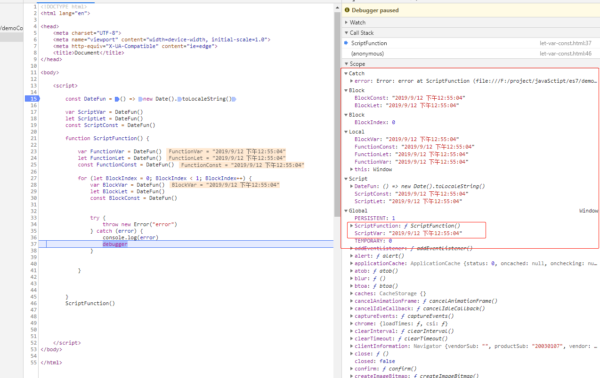

# 第21-30题

## 21、有以下 3 个判断数组的方法，请分别介绍它们之间的区别和优劣

```
Object.prototype.toString()、instanceof、Array.isArray();
```

Array.isArray()在低版本不支持，会使用toString（）; instanceof是在原型链上去查找是否存在，只针对对象类型。

## 22、介绍下重绘以及回流，（Repaint & Reflow），以及如何优化

- 回流，布局或者几何属性需要改变,dom结构发送变化，例如width、height、padding、position、fontSize
- 重绘，几何属性发生改变或者由于样式发生改变而不会影响布局的，例如，color、background-color、visibility

回流一定引起重绘，重绘不一定引起回流。

### 浏览器渲染机制

- 浏览器采用流式布局模型
- 浏览器会把HTML解析成DOM，把CSS解析成CSSOM，DOM和CSSOM结合就生成了Render tree
- 有了Render Tree，我们就知道节点的位置以及节点的样式，然后计算他们在页面上的大小和位置，最后绘制到页面上。
- 由于浏览器采用流式布局，对Render Tree通常只需要遍历一次就可以完成，但table及其内部元素除外，他们 可能需要多次计算，通常要多花3倍同等元素的时间，这也就是尽量避免使用table布局的原因。

### 优化：

#### CSS

- 使用 transform 替代 top
- 使用 visibility 替换 display: none ，因为前者只会引起重绘，后者会引发回流（改变了布局
- 避免使用table布局，可能很小的一个小改动会造成整个 table 的重新布局。
- 尽可能在DOM树的最末端改变class，回流是不可避免的，但可以减少其影响。尽可能在DOM树的最末端改变class，可以限制了回流的范围，使其影响尽可能少的节点。
- 避免设置多层内联样式，CSS 选择符从右往左匹配查找，避免节点层级过多。
- 避免使用CSS表达式，可能会引发回流。
- 将频繁重绘或者回流的节点设置为图层，图层能够阻止该节点的渲染行为影响别的节点，例如will-change、video、iframe等标签，浏览器会自动将该节点变为图层。
- CSS3 硬件加速（GPU加速），使用css3硬件加速，可以让transform、opacity、filters这些动画不会引起回流重绘
  。但是对于动画的其它属性，比如background-color这些，还是会引起回流重绘的，不过它还是可以提升这些动画的性能。

#### JavaScript

- 避免频繁操作样式，最好一次性重写style属性，或者将样式列表定义为class并一次性更改class属性。
- 避免频繁操作DOM，创建一个documentFragment，在它上面应用所有DOM操作，最后再把它添加到文档中。
- 避免频繁读取会引发回流/重绘的属性，如果确实需要多次使用，就用一个变量缓存起来。
- 对具有复杂动画的元素使用绝对定位，使它脱离文档流，否则会引起父元素及后续元素频繁回流。

## 23、介绍一下订阅者和发布订阅的区别，各自适应什么场景。

### 区别

是否存在第三方、发布者能否直接感知订阅者。

观察者模式，解决的其实是模块间的耦合问题，有它在，即使是两个分离的、毫不相干的模块，也可食实现数据通信。 但观察者模式仅仅是为了减少了耦合，并没有完全的解决耦合问题-被观察者必须去维护一套观察者的集合，这些
观察者必须实现统一的方法供观察者调用，两者之间还是有着说不清、道不明的关系，

而发布订阅则是快刀斩乱麻-发布者完全不用感知订阅者，不用关心它怎么实现回调方法，事件的注册和触发都发生 在独立于第三方平台（事件总线）上，发布订阅模式下，实现了完全的解耦。

### 适用场景

但并不是说发布订阅更高级。如果两个模块本身之间存在关联，且这种关联是稳定的、必要的，那么我们使用 观察者模式就足够了/而在模块与模块之间独立性较强、且没有必要单纯为了数据通信而强行为两者制造依赖，我们 往往会倾向于使用发布订阅模式。

````javascript
// 观察者
class Publisher {
  constructor() {
    this.observes = [];
  }

  add(obserer) {
    this.observers.push(obserer);
  }

  remove(observer) {
    this.observers.filter(item => {
      item !== observer
    });
  }

  notify() {
    this.observers.forEach(observer => {
      observer.update(this);
    })
  }
}

class Obserer {
  constuctor() {

  }

  update() {

  }
}
````

待手写发布订阅

## 24、聊聊Redux和Vuex的设计思想。

### 共同点

首先两者都是处理全局状态的工具库，大致实现思想都是：全局state保存状态---> dispatch(action) ---->
reduce(Vuex里的mutation) ---> 生成newState； 整个状态为同步操作。

### 不同点

最大的区别在于处理异步的不同，vuex里面多了一步commit操作，在action之后commit（mutation）之前 处理异步，而redux则是通过中间件处理。

## 25、说说浏览器和Node事件循环的区别

浏览器环境下，microtask的任务队列是每个macrotask执行完之后执行的。

而在node环境，microtask会在事件循环的各个阶段之间执行，也就是一个阶段执行完毕，就会去执行microtask 队列的任务。

补充一个例子

```javascript
setTimeout(() => {
  console.log('timer1')
  Promise.resolve().then(function () {
    console.log('promise1')
  })
}, 0)
setTimeout(() => {
  console.log('timer2')
  Promise.resolve().then(function () {
    console.log('promise2')
  })
}, 0)
```

- 浏览器端-输出顺序 timer1 promise timer promise2

- 如果是node11版本一旦执行一个阶段里的一个宏任务(setTimeout,setInterval和setImmediate)
  就立刻执行微任务队列，这就跟浏览器端运行一致，最后的结果为timer1=>promise1=>timer2=>promise2
- 如果是node10及其之前版本：要看第一个定时器执行完，第二个定时器是否在完成队列中。

    - 如果是第二个定时器还未在完成队列中，最后的结果为timer1=>promise1=>timer2=>promise2
    - 如果是第二个定时器已经在完成队列中，则最后的结果为timer1=>timer2=>promise1=>promise2

## 26、介绍模块化发展过程

```javascript
// 可从IIFE、AMD、CMD、CommonJS、UMD、 webpack(require.ensure)、
// ES Module、<script type="module"> 这几个角度考虑
```

### IIFE 自执行函数

**特点：在一个单独的函数作用域中执行，避免变量冲突。**

```javascript
(function () {
  return [];
})()
```

### CommonJS

Node.js是common.js的主要实践者，
**特点：同步加载。服务端都存在本地磁盘，比较适合， 但是浏览器端比较适合，因为网络原因**

```javascript
var fs = require('fs');
```

### AMD

通过require.js实现
**特点：依赖前置，提前执行**

```javascript
define('./index.js', function (code) {
  // code 就是index.js的返回值。
})
```

### CMD

通过sea.js
**特点：依赖就近，延迟执行**

```javascript
define(function (require, exports, module) {
  var indexCode = require('./index.js');
});
```

### UMD：兼容AMD，CommonJS 模块化语法。

### ES6 Module 运行时加载 原生实现。

### 差异对比

### ES6 模块与 CommonJS 模块的差异

1、CommonJS是值得一个拷贝，ES6是值的一个引用

2、CommonJS模块是运行时加载，ES6是编译时输出的接口。

- 即在输入时是先加载整个模块，生成一个对象，然后再从这个对象上面读取方法，这种加载称为“运行时加载”。

- 即在import时可以指定加载某个输出值，而不是加载整个模块，这种加载称为“编译时加载”。

## 27、const、let声明的变量不在window，那去了哪里呢。

作用域分为三种：全局作用域、函数作用域、块级作用域。


## 28、cookie和token都存在header，为什么不会劫持token。

其中之一特效，就是可以设置请求自动携带cookie，从而通过csrf来劫持cookie。 而token是主动添加的，存储位置不固定。无法自动携带token

XSS: 攻击是页面被注入了恶意的代码(字符串转译)
CSRF: 在页面中点击外链，冒名，携带cookie。

## 29、聊聊Vue的双向绑定，Model如何改变View，View又是如何改变Model的。

发布订阅

Object.defineProperty劫持数据，此时当前收集数据，数据改变，触发set，从而notify更新视图。

## 30、两个数组合并成一个数组

请把两个数组 ['A1', 'A2', 'B1', 'B2', 'C1', 'C2', 'D1', 'D2'] 和
['A', 'B', 'C', 'D']，合并为
['A1', 'A2', 'A', 'B1', 'B2', 'B', 'C1', 'C2', 'C', 'D1', 'D2', 'D']。

```javascript
const A1 = ['A1', 'A2', 'B1', 'B2', 'C1', 'C2', 'D1', 'D2'];
const A2 = ['A', 'B', 'C', 'D'];

const concat = A1.concat(A2);

concat.sort((a,b) => {
  const a1 = a.length === 1 ? a.charCodeAt() : a.charCodeAt() - (Number(a[1]) / 100);
  const b1 = b.length === 1 ? b.charCodeAt() : b.charCodeAt() - (Number(a[1]) / 100);
  return a1 - b1;
});
```
