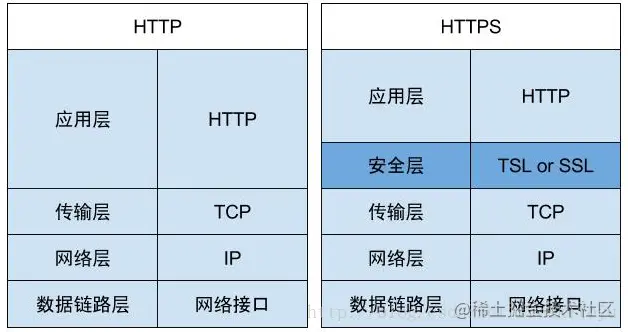

# 第 41 - 50 题

## 41、下面代码输出什么

```javascript
var a = 10;
(function () {
  console.log(a)
  a = 5
  console.log(window.a)
  var a = 20;
  console.log(a)
})()
```

undefined、10、20

## 42、实现一个 sleep 函数

比如 sleep(1000) 意味着等待1000毫秒，可从 Promise、Generator、Async/Await 等角度实现

```javascript
function sleep(time = 1000) {
  return new Promise(resolve => {
    setTimeout(resolve, time);
  })
}
```

```javascript
function* sleepGenerator(time) {
  yield new Promise(resolve => setTimeout(resolve, time))
}

sleepGenerator(1000).next().value.then(() => console.log(1));
```

## 43、使用 sort() 对数组 [3, 15, 8, 29, 102, 22] 进行排序，输出结果

102、15、22、29、3、8

## 44、介绍 HTTPS 握手过程

;

### 1、HTTPS为什么会出现

因为http是明文传输，是不安全的。

在HTTP的传输过程中，任何人都有可能从中截取、修改、伪造请求发送。

也就是缺少了身份验证、验证报文的完整性。

**传输层安全性（TLS）是 安全套接字层（SSL）的后续版本**

HTTP + SSL（TSL） = HTTPS

### 2、HTTPS做了什么

- 加密 数据加密，避免用户信息被窃用
- 数据一致性 数据在传输过程中不会被篡改，完成发送。
- 身份认证 防止中间人攻击并建立用户信任。

### 3、探究HTTPS

#### 对称加密

定义：使用相同的密钥进行加密和解密。

这就相当于是用密钥进行加密，然后把密钥交给解密方进行解密。这就出现了风险性。

#### 非对称加密

定义：使用公钥进行加密，使用私钥进行解密。同时私钥进行加密的数据，公钥也可以解密。

网站保管私钥，公钥进行传输。保证了数据的安全性质。

#### 混合加密

因为非对称加密的运算比较慢，而对称加密运算就很快。

在通信刚开始时，使用非对称加密，进行密钥的交换。然后用随机数对称算法使用的回话密钥，再用公钥进行加密。 对方拿到密文之后使用私钥进行解密。

在机密性的基础上，还要加上完整性以及身份认证的东西。

### 摘要算法

定义：一种特殊的压缩算法，把任意长度的数据压缩成固定长度的字符串，这就好像给数据上了一把锁。

### 认证

私钥是自己生成，公钥是别人颁发的。CA证书

## 45、HTTPS 握手过程中，客户端如何验证证书的合法性

（1）首先浏览器读取证书中的证书所有者、有效期等信息进行校验，校验证书的网站域名是否与证书颁发的域名一致，校验证书是否在有效期内

（2）浏览器开始查找操作系统中已内置的受信任的证书发布机构CA，与服务器发来的证书中的颁发者CA比对，用于校验证书是否为合法机构颁发

（3）如果找不到，浏览器就会报错，说明服务器发来的证书是不可信任的。

（4）如果找到，那么浏览器就会从操作系统中取出颁发者CA 的公钥(多数浏览器开发商发布 版本时，会事先在内部植入常用认证机关的公开密钥)，然后对服务器发来的证书里面的签名进行解密

（5）浏览器使用相同的hash算法计算出服务器发来的证书的hash值，将这个计算的hash值与证书中签名做对比

（6）对比结果一致，则证明服务器发来的证书合法，没有被冒充

## 46、输出以下代码执行的结果并解释为什么。

```javascript
var obj = {
  '2': 3,
  '3': 4,
  'length': 2,
  'splice': Array.prototype.splice,
  'push': Array.prototype.push
}
obj.push(1)
obj.push(2)
console.log(obj);
```

## 47、双向绑定和 vuex 是否冲突

[官方解释](https://vuex.vuejs.org/zh/guide/forms.html);

## 48、call和apply的区别是什么，哪个性能好一点。

Function.prototype.apply和Function.prototype.call 的作用是一样的，区别在于传入参数的不同；

- 第一个参数都是，指定函数体内this的指向；
- 第二个参数开始不同，apply是传入带下标的集合，数组或者类数组，call从第 二个开始传入的参数是不固定的，都会传给函数作为参数。

call的性能要比apply的性能要好，（从jquery、lodash），因为call 传入参数的格式都是函数所需要的。

## 49、为什么通常在发送数据埋点请求的时候使用的是 1x1 像素的透明 gif 图片？

因为1*1像素的gif，最小。

1) 图片天然自带跨域。
2) 不会阻塞页面加载，随时随地可以new Image出来。
3) 图片不占用ajax请求限额
4) gif的合法体积最小

## 50、实现 (5).add(3).minus(2) 功能。

```javascript
Number.prototype.add = function(n) {
  console.log(this);
  return this.valueOf() + n;
};
Number.prototype.minus = function(n) {
  return this.valueOf() - n;
};
(5).add(3).minus(2)
```
