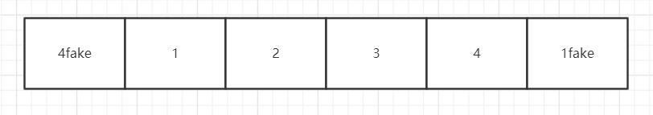

# 第 61 - 70 题

## 61、如何实现token加密

JWT

1) 需要一个secret（随机数）
2) 后端利用secret和加密算法(如：HMAC-SHA256)对payload(如账号密码)生成一个字符串(token)，返回前端
3) 前端每次request在header中带上token
4) 后端用同样的算法解密

## 62、redux为什么要把reducer设计成纯函数

reducer的作用，接收旧的state和action，返回新的state。

redux的设计思想就是不产生副作用，数据更改点状态可回溯，所以redux中处处是纯函数。

## 63、如何设计实现无缝轮播

; 核心点就是clone首位两张图片一样。

简单来说，无缝轮播的核心是制造一个连续的效果。 最简单的方法就是复制一个轮播的元素，当复制元素将要滚到目标位置后， 把原来的元素进行归位的操作，以达到无缝的轮播效果。

## 64、模拟实现一个finally

```javascript
new Promise((resolve, reject) => {
  resolve();
}).finally(() => {
  console.log('finally1');
}).then(() => {
  console.log('then');
}).finally(() => {
  console.log('finally2');
});
// finally1 then finally2
```

finally不管成功还是失败都会立刻执行，而不会永远最后执行

```javascript
Promise.prototype.finally = function (callback) {
  const P = this.constructor; // 等价于Promise

  return this.then(
    value => P.resolve(callback()).then(() => value),
    error => P.resolve(callback()).then(() => throw error)
  );
}
```

## 65、a.b.c.d 和 a['b']['c']['d']，哪个性能更高？

a.b.c.d 比 a['b']['c']['d'] 性能高点， 因为[ ]里面有可能是字符串，有可能是变量， 至少多一次判断，而a.b.c.d是直接取用该字符串当作属性名的

## 66、ES6转ES5代码的实现思路是什么

babel执行流程

1) 解析代码字符串，生成AST
2) 然后再将ES6 AST 转换成ES5的AST
3) 将修改后的AST再转换成普通代码

## 67、数组编程题

随机生成一个长度为 10 的整数类型的数组，例如 [2, 10, 3, 4, 5, 11, 10, 11, 20]， 将其排列成一个新数组，要求新数组形式如下，例如 [[2, 3, 4, 5], [10, 11], [20]]。

```javascript
const randomAry = function () {
  const arr = new Array(10).fill(7);
  return arr.map(() => {
    return Math.floor(Math.random() * 100)
  })
}

const arr = randomAry();
const sortArr = [...new Set(arr)].sort((a, b) => a - b);

const map = new Map();

sortArr.forEach(item => {
  const key = JSON.stringify(item).length
  if (map.has(key)) {
    map.set(key, [...map.get(key), item])
  } else {
    map.set(key, []);
  }
})
```

## 68、如何解决移动端retina屏1px像素问题。

伪类 + transform

## 69、如何把一个字符串的大小写取反（大写变小写小写变大写），例如 ’AbC' 变成 'aBc' 。

```javascript
const str = 'AbC'.split();

for (let i = 0; i < str.length; i++) {
  if (str[i].charCodeAt() >= 97) {
    str[i] = str[i].toUpperCase();
  } else {
    str[i] = str[i].toLowerCase();
  }
}
console.log(str.toString());
```
```javascript
function swapString(str) {
  var result = ''

  for (var i = 0; i < str.length; i++) {
    var c = str[i]

    if (c === c.toUpperCase()) {
      result += c.toLowerCase()
    } else {
      result += c.toUpperCase()
    }
  }

  return result
}

swapString('ADasfads123!@$!@#') // => 'adASFADS123!@$!@#'
```
## 70、介绍下 webpack 热更新原理，是如何做到在不刷新浏览器的前提下更新页面的
// TODOv
