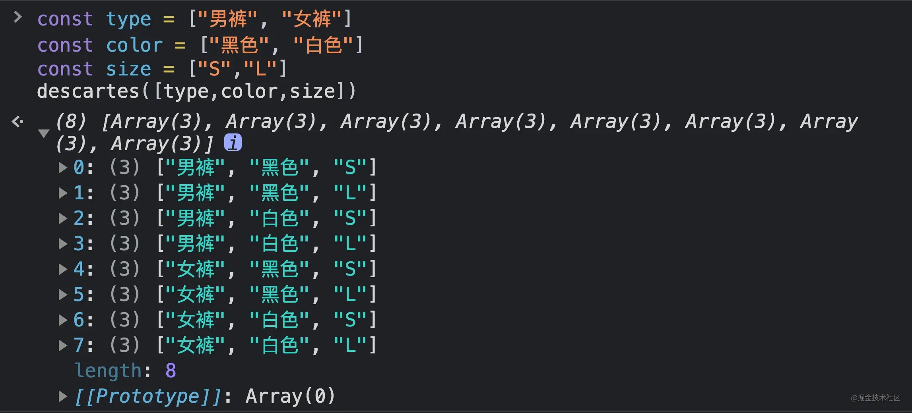
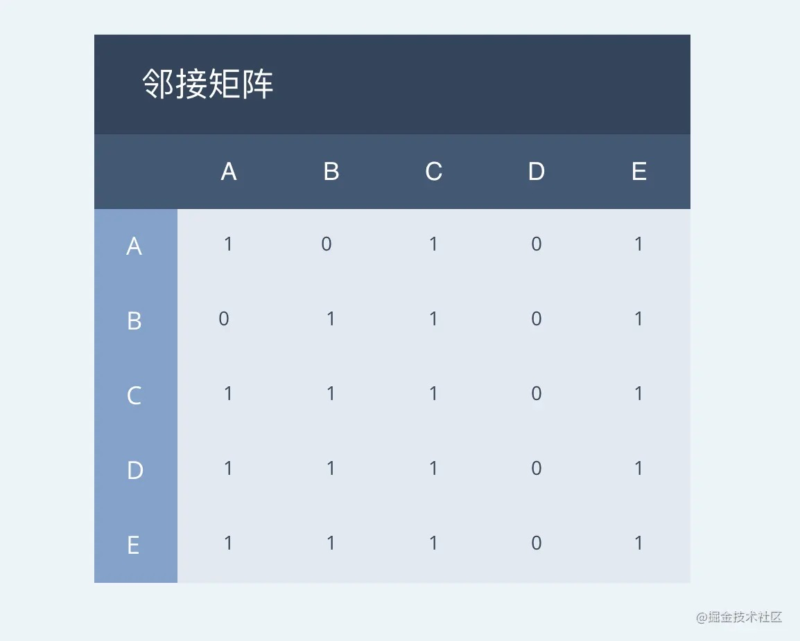
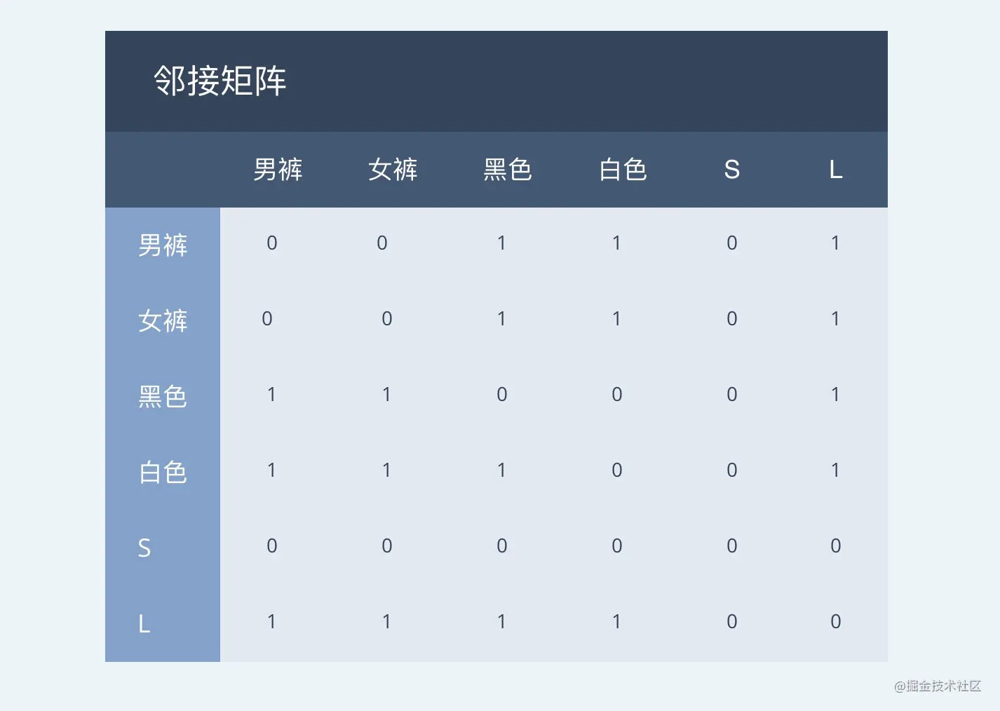
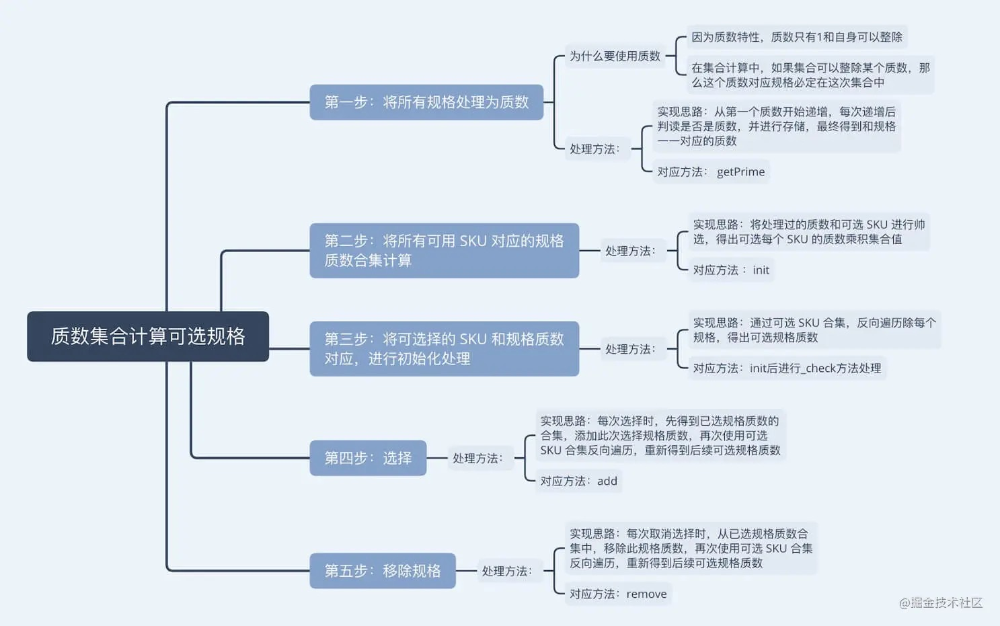

# SKU和算法实现
## 组装SKU实践
### sku 组合实现思路
#### 笛卡尔积
笛卡尔积的描述

- 笛卡尔积是指在数学中，两个[集合] X和Y的笛卡尔积，又称[直积]，表示X * Y，第一个对象是X的成员而第二个
对象是Y的所有可能[有序对]的其中一个成员。
- 假设集合A = { a, b }, 集合B = { 0, 1, 2 }, 则两个集合的笛卡尔积为 { (a,0), (a,1), (a,2),
(b,0), (b,1), (b,2) }

```js
const arr = [
  ['男裤', '女裤'],
  ['黑色', '白色'],
  ['S', 'L']
]
const temp = arr.reduce((a, b) => { return a.flatMap(x => b.map(y => [...x, y]))}, [[]] );
console.log('All temp', temp);
```

flatMap()方法对原数组的每个成员执行一个函数，
相当于执行Array.prototype.map(),然后对返回值组成的数组执行flat()方法。该方法返回一个新数组，
不改变原数组。
```js
var a = [1,2,3];
var b = [3,4];
a.map(a => ( b.map(o => [a,o]) ))
// [[1,3],[1,4]],[[2,3],[2,4]], [[3,3],[3,4]]]
a.flatMap(a => (b.map(o => [a,o])))

```


### 邻接矩阵
- 用一个二维数据存放顶点间关系（边或弧）的数据，这个二维数组称为邻接矩阵。
- 逻辑结构分为两部分：V和E集合，其中V是顶点，E是边。因此，用一个一维数组存放图中所有顶点数据。 



