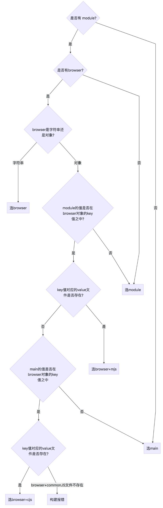

# browser VS module VS main

## 字段定义
- main : 定义了 npm 包的入口文件，browser 环境和 node 环境均可使用
- module : 定义 npm 包的 ESM 规范的入口文件，browser 环境和 node 环境均可使用
- browser : 定义 npm 包在 browser 环境下的入口文件

## 结论
- 如果npm包导出的是ESM规范的包，使用module
- 如果npm包只在web端用，并且严禁在server端使用，使用browser。
- 如果npm只在server端使用，使用main。
- npm包在web端和server端都允许使用，使用browser和main

### look

