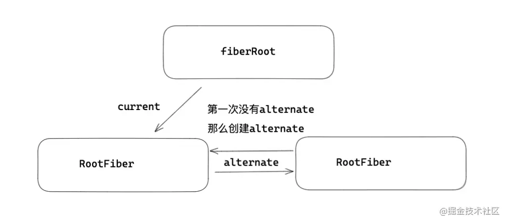

# Fiber架构的工作原理

我们首先了解了Fiber是什么，Fiber节点可以保存相应的DOM节点，相应的Fiber节点构成的Fiber树就
对应DOM树。

## 什么是双缓存
在内存中g构建并直接替换的技术-叫做[双缓存](https://baike.baidu.com/item/%E5%8F%8C%E7%BC%93%E5%86%B2)

React使用"双缓存"来完成并Fiber的构建和替换-对应DOM树的创建和更新。

## 双缓存Fiber树

- fiberRoot: 首次构建应用，创建一个fiberRoot，作为整个应用的根基
- rootFiber：如下通过ReactDOM.render渲染出来的，比如App可以作为一个rootFiber。一个React应用可以
有多个ReactDOM.render创建的rootFiber，但是只能有一个fiberRoot（应用根节点）。

```jsx harmony
ReactDOM.render(<App/>, document.getElementById('app'));
```

第一次挂载的过程中，会将 fiberRoot 和 rootFiber 建立起关联。

```js
function createFiberRoot(containerInfo,tag){
    /* 创建一个root */
    const root = new FiberRootNode(containerInfo,tag)
    const rootFiber = createHostRootFiber(tag);
    root.current = rootFiber
    return root
}
```

当前屏幕上显示对应内容的 - current Fiber
正在内存中构建的 - workInProgress Fiber

他们通过alternate属性来连接

```js
currentFiber.alternate = workInProgressFiber;

workInProgressFiber.alternate = currentFiber;
```


React应用的根节点通过使current指针在不同的fiber树rootFiber间切换来完成current Fiber树指向的切换。

即当workInProgress Fiber树构建完成交给Renderer渲染在页面上后，
应用根节点的current指针指向workInProgress Fiber树，
此时workInProgress Fiber树就变为current Fiber树。

每次状态更新都会产生新的workInProgress Fiber树，
通过current与workInProgress的替换，完成DOM更新。


## mount时

## update时
