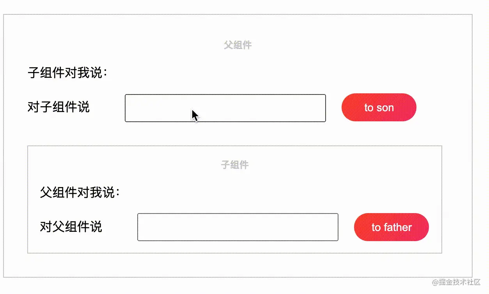
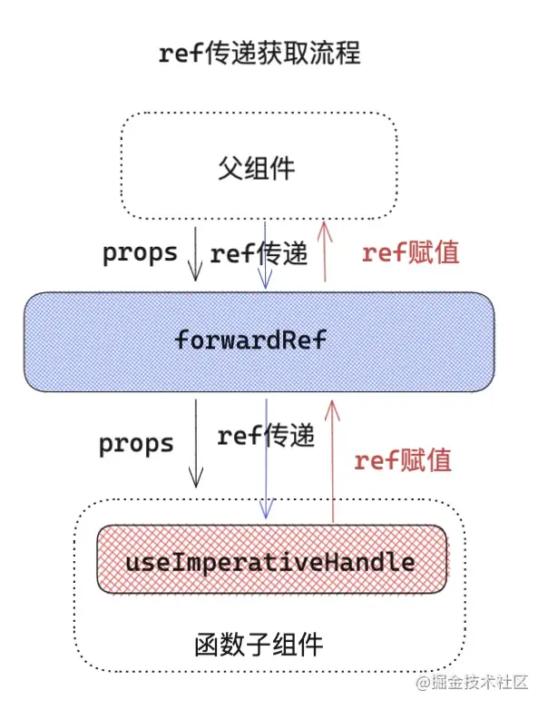
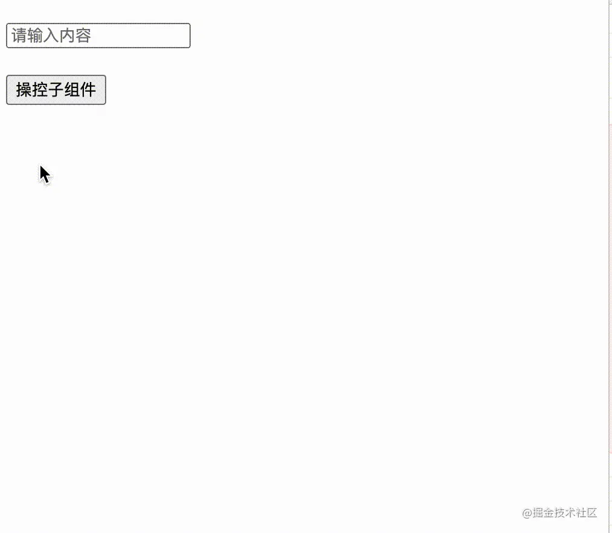

# 多功能Ref

## 前置知识了解
### useEffect 和 useLayoutEffect
**useEffect**

对于 useEffect 执行，
 React 处理逻辑是采用异步调用 ， 对于每一个 effect 的 callback，
  React 会向 setTimeout回调函数一样，放入任务队列，
  等到主线程任务完成，DOM 更新，js 执行完成，视图绘制完毕，才执行。
  所以 effect 回调函数不会阻塞浏览器绘制视图。
  
**useLayoutEffect**

- 首先 useLayoutEffect 是在DOM 绘制之前，这样可以方便修改 DOM ，这样浏览器只会绘制一次，
如果修改 DOM 布局放在 useEffect ，那 useEffect 执行是在浏览器绘制视图之后，接下来又改 DOM ，
就可能会导致浏览器再次回流和重绘。而且由于两次绘制，视图上可能会造成闪现突兀的效果。
- useLayoutEffect callback 中代码执行会阻塞浏览器绘制。

## 一、前言
对于Ref，我们在上面get到的就是Ref获取的是真实的DOM元素和获取类组件实例

## 二、ref基础概念和理解

### Ref对象创建
```jsx harmony
class Index extends React.Component{
    constructor(props){
       super(props)
       this.currentDom = React.createRef(null)
    }
    componentDidMount(){
        console.log(this.currentDom)
    }
    render= () => <div ref={ this.currentDom } >ref对象模式获取元素或组件</div>
}
// 解释createRef

export function createRef() {
  const refObject = {
    current: null,
  }
  return refObject;
}

```
::: tip 注意
 不要在函数组件中使用 createRef，否则会造成 Ref 对象内容丢失等情况。
:::


```jsx harmony
export default function Index(){
    const currentDom = React.useRef(null)
    React.useEffect(()=>{
        console.log( currentDom.current ) // div
    },[])
    return  <div ref={ currentDom } >ref对象模式获取元素或组件</div>
}
```

createRef和useRef底层逻辑差不多，就是ref保存的位置不同，类组件中有实例instance能够维护ref信息，但是由于函数组件每次更新都是一次新的开始，所有变量重新声明，
所以useRef不能直接return，把ref对象直接暴露出去，此时 ref 就会随着函数组件执行被重置，这就解释了在函数组件中为什么不能用 createRef 的原因。

为了解决这个问题，hooks和函数组件对应的fiber对象建立关联，讲uedRef产生的ref对象挂载到函数组件对应的fiber，函数每次执行，只要组件不被销毁，
函数组件对应的fiber就会一直存在，所以ref等信息就会被保留下来。

### React对Ref属性的处理-标记ref

```jsx harmony

/* 类组件 */
class Children extends Component{  
    render=()=><div>hello,world</div>
}
/* TODO:  Ref属性是一个字符串 */
export default class Index extends React.Component{
    componentDidMount(){
       console.log(this.refs)
    }
    render=()=> <div>
        <div ref="currentDom"  >字符串模式获取元素或组件</div>
        <Children ref="currentComInstance"  />
    </div>
}

class Children extends React.Component{  
    render=()=><div>hello,world</div>
}
/* TODO: Ref属性是一个函数 */
export default class Index extends React.Component{
    currentDom = null
    currentComponentInstance = null
    componentDidMount(){
        console.log(this.currentDom)
        console.log(this.currentComponentInstance)
    }
    render=()=> <div>
        <div ref={(node)=> this.currentDom = node }  >Ref模式获取元素或组件</div>
        <Children ref={(node) => this.currentComponentInstance = node  }  />
    </div>
}


class Children extends React.Component{  
    render=()=><div>hello,world</div>
}
export default class Index extends React.Component{
    currentDom = React.createRef(null)
    currentComponentInstance = React.createRef(null)
    componentDidMount(){
        console.log(this.currentDom)
        console.log(this.currentComponentInstance)
    }
    render=()=> <div>
         <div ref={ this.currentDom }  >Ref对象模式获取元素或组件</div>
        <Children ref={ this.currentComponentInstance }  />
   </div>
}
```
## 三、ref高阶用法

### forwardRef转发Ref

forwardRef的初衷是为了解决ref不能跨层级捕获和传递的问题。forwardRef接受父级元素标记的ref信息，并把它转发下去，使得子组件可以通过props来接受到上一层或者
是更上层级的ref。

#### ① 场景一：跨层级获取

场景：想要在 GrandFather 组件通过标记 ref ，来获取孙组件 Son 的组件实例。
```jsx harmony
// 孙组件
function Son (props){
    const { grandRef } = props
    return <div>
        <div> i am alien </div>
        <span ref={grandRef} >这个是想要获取元素</span>
    </div>
}
// 父组件
class Father extends React.Component{
    constructor(props){
        super(props)
    }
    render(){
        return <div>
            <Son grandRef={this.props.grandRef}  />
        </div>
    }
}
const NewFather = React.forwardRef((props,ref)=> <Father grandRef={ref}  {...props} />)
// 爷组件
class GrandFather extends React.Component{
    constructor(props){
        super(props)
    }
    node = null 
    componentDidMount(){
        console.log(this.node) // span #text 这个是想要获取元素
    }
    render(){
        return <div>
            <NewFather ref={(node)=> this.node = node } />
        </div>
    }
}
```
#### ② 场景二:合并转发ref

场景：想通过Home绑定ref，来获取子组件Index的实例index，dom元素button，以及孙组件Form的实例


```jsx harmony
// 表单组件
class Form extends React.Component{
    render(){
       return <div>{...}</div>
    }
}
// index 组件
class Index extends React.Component{ 
    componentDidMount(){
        const { forwardRef } = this.props
        forwardRef.current={
            form:this.form,      // 给form组件实例 ，绑定给 ref form属性 
            index:this,          // 给index组件实例 ，绑定给 ref index属性 
            button:this.button,  // 给button dom 元素，绑定给 ref button属性 
        }
    }
    form = null
    button = null
    render(){
        return <div   > 
          <button ref={(button)=> this.button = button }  >点击</button>
          <Form  ref={(form) => this.form = form }  />  
      </div>
    }
}
const ForwardRefIndex = React.forwardRef(( props,ref )=><Index  {...props} forwardRef={ref}  />)
// home 组件
export default function Home(){
    const ref = useRef(null)
     useEffect(()=>{
         console.log(ref.current)
     },[])
    return <ForwardRefIndex ref={ref} />
}
```
#### ③ 场景三：高阶组件转发
如果通过高阶组件包裹一个原始类组件，就会产生一个问题，如果高阶组件 HOC 没有处理 ref ，
那么由于高阶组件本身会返回一个新组件，所以当使用 HOC 包装后组件的时候，标记的 ref 会指向 HOC 返回的组件，
而并不是 HOC 包裹的原始类组件，为了解决这个问题，forwardRef 可以对 HOC 做一层处理。

```jsx harmony
function HOC(Component){
  class Wrap extends React.Component{
     render(){
        const { forwardedRef ,...otherprops  } = this.props
        return <Component ref={forwardedRef}  {...otherprops}  />
     }
  }
  return  React.forwardRef((props,ref)=> <Wrap forwardedRef={ref} {...props} /> ) 
}
class Index extends React.Component{
  render(){
    return <div>hello,world</div>
  }
}
const HocIndex =  HOC(Index)
export default ()=>{
  const node = useRef(null)
  useEffect(()=>{
    console.log(node.current)  /* Index 组件实例  */ 
  },[])
  return <div><HocIndex ref={node}  /></div>
}
```
### ref实现组件通信

如果有种场景不想通过父组件render改变props的方式，来触发更新子组件，也就是子组件通过state单独管理数据层，针对这种情况父组件可以通过ref模式标记子组件实例，
从而操纵子组件的方法，这种方式一般出现在**数据层托管的组件**上。比如`<Form/>`,经典案例可以参考 antd 里面的 form 表单，暴露出对外的resetFields ， setFieldsValue,
等接口，可以通过表单实例调用这些API。

#### ① 类组件 ref

```jsx harmony
/* 子组件 */
class Son extends React.PureComponent{
    state={
       fatherMes:'',
       sonMes:''
    }
    fatherSay=(fatherMes)=> this.setState({ fatherMes  }) /* 提供给父组件的API */
    render(){
        const { fatherMes, sonMes } = this.state
        return <div className="sonbox" >
            <div className="title" >子组件</div>
            <p>父组件对我说：{ fatherMes }</p>
            <div className="label" >对父组件说</div> <input  onChange={(e)=>this.setState({ sonMes:e.target.value })}   className="input"  /> 
            <button className="searchbtn" onClick={ ()=> this.props.toFather(sonMes) }  >to father</button>
        </div>
    }
}
/* 父组件 */
export default function Father(){
    const [ sonMes , setSonMes ] = React.useState('') 
    const sonInstance = React.useRef(null) /* 用来获取子组件实例 */
    const [ fatherMes , setFatherMes ] = React.useState('')
    const toSon =()=> sonInstance.current.fatherSay(fatherMes) /* 调用子组件实例方法，改变子组件state */
    return <div className="box" >
        <div className="title" >父组件</div>
        <p>子组件对我说：{ sonMes }</p>
        <div className="label" >对子组件说</div> <input onChange={ (e) => setFatherMes(e.target.value) }  className="input"  /> 
        <button className="searchbtn"  onClick={toSon}  >to son</button>
        <Son ref={sonInstance} toFather={setSonMes} />
    </div>
}
```
效果图：


#### 函数组件 forwardRef + useImperativeHandle

对于函数组件，本身是没有组件实例的，但是React Hook提供来useImperativeHandle

useImperativeHandle 接受三个参数

- 第一个参数ref：接受forWardRef传递过来的ref。
- 第二个参数createHandle：处理函数，返回值作为暴露给父组件的ref对象。
- 第三个参数deps：依赖项deps，依赖项更改返回新的ref对象。


forWardRef + useImperativeHandle 可以完全让函数组件也能流畅的使用Ref进行通讯。原理如下图：

```jsx harmony
// 子组件
function Son (props,ref) {
    const inputRef = useRef(null)
    const [ inputValue , setInputValue ] = useState('')
    useImperativeHandle(ref,()=>{
       const handleRefs = {
           onFocus(){              /* 声明方法用于聚焦input框 */
              inputRef.current.focus()
           },
           onChangeValue(value){   /* 声明方法用于改变input的值 */
               setInputValue(value)
           }
       }
       return handleRefs
    },[])
    return <div>
        <input placeholder="请输入内容"  ref={inputRef}  value={inputValue} />
    </div>
}

const ForwarSon = React.forwardRef(Son)
// 父组件
class Index extends React.Component{
    cur = null
    handerClick(){
       const { onFocus , onChangeValue } =this.cur
       onFocus() // 让子组件的输入框获取焦点
       onChangeValue('let us learn React!') // 让子组件input  
    }
    render(){
        return <div style={{ marginTop:'50px' }} >
            <ForwarSon ref={cur => (this.cur = cur)} />
            <button onClick={this.handerClick.bind(this)} >操控子组件</button>
        </div>
    }
}
```

效果图


### 函数组件缓存数据

函数组件每一次render，函数上下文都会重新执行，那么有一种情况就是，在执行一些事件方法改变数据或者保存新数据的时候，有没有必要更新视图，有没有必要把数据
放到state当中，如果视图不更新想依赖的数据，那么state改变带来的更新就是多余的。这时候更新无疑是性能上的浪费。

好处有：
- 第一个，能够直接修改数据，不回造成函数组件冗余的副作用。
- 第二个，useRef保存数据，如果在useEffect、useMemo当中引用了ref对象中的数据，无须将ref对象添加成deps依赖，因为useRef始终指向一个内存空间，
所以这样一点的好处，可以随时访问到变化后，最新的值。

## 四、ref原理揭秘
