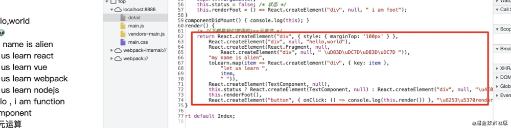
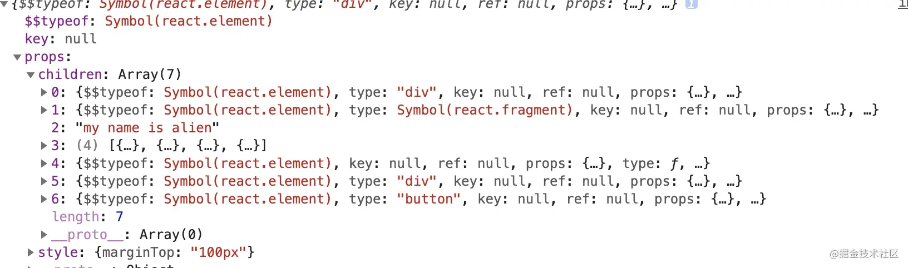
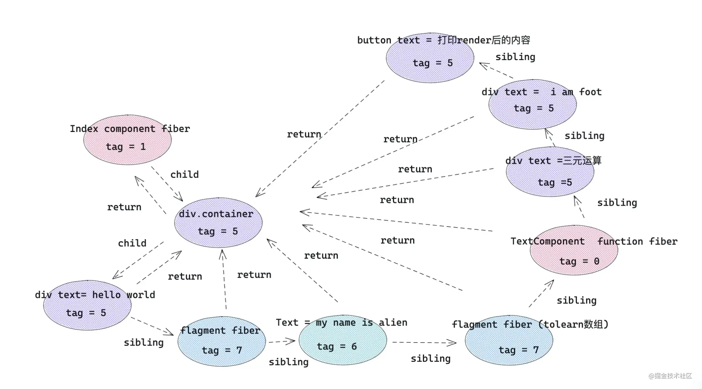

# 认识 jsx
## 一 我们写的 JSX 终将变成什么
- 了解jsx被React处理成什么，有利于我们理解react fiber类型。
- 理解jsx的编译过程，方便操作children、控制React渲染，有利于便捷使用react插槽组件。

```jsx {8-26}
const TextComponent = ()=> <div> hello , i am function component </div> 

class Index extends React.Component{
    status = false /* 状态 */
    renderFoot=()=> <div> i am foot</div>
    render(){
        /* 以下都是常用的jsx元素节 */
        return <div style={{ marginTop:'100px' }}   >
            { /* element 元素类型 */ }
            <div>hello,world</div>
            { /* fragment 类型 */ }
            <React.Fragment>
                <div> 👽👽 </div>
            </React.Fragment>
            { /* text 文本类型 */ }
            my name is alien 
            { /* 数组节点类型 */ }
            { toLearn.map(item=> <div key={item} >let us learn { item } </div> ) }
            { /* 组件类型 */ }
            <TextComponent/>
            { /* 三元运算 */  }
            { this.status ? <TextComponent /> : <div>三元运算</div> }
            { /* 函数执行 */ } 
            { this.renderFoot() }
            <button onClick={ ()=> console.log( this.render() ) } >打印render后的内容</button>
        </div>
    }
}
```
### 1 babel 处理后的样子


React Element
```js
React.createElement(
  type,
  [props],
  [...children]
)
```
createElement 参数：

- 第一个参数：如果是组件类型，会传入组件对应的类或函数；如果是 dom 元素类型，传入 div 或者 span 之类的字符串。

- 第二个参数：一个对象，在 dom 类型中为标签属性，在组件类型中为 props 。

- 其他参数：依次为 children，根据顺序排列。

### 2 createElement 处理后的样子


从上面写的 jsx 结构来看，外层的 div 被 react.createElement 转换成 react element 对象，
div 里面的 8 个元素分别转换成 children 子元素列表。
下面就是 jsx 的转换规则。

| jsx元素类型	|react.createElement 转换后 |	type 属性 |
| ------------- |:--------:| -------------:|
| elment元素类型	| react element类型	| 标签字符串，例如 div |
| fragment类型	| react element类型	| symbol react.fragment类型 |
| 文本类型	| 直接字符串	| 无 |
| 数组类型	| 返回数组结构，里面元素被react.createElement转换 |	无 |
| 组件类型	| react element类型	| 组件类或者组件函数本身 |
| 三元运算 / 表达式 |	先执行三元运算，然后按照上述规则处理	| 看三元运算返回结果 |
| 函数执行	| 先执行函数，然后按照上述规则处理	| 看函数执行返回结果

### 3 React 底层调和处理后，终将变成什么？

最终，在调和阶段，上述 React element 对象的每一个子节点都会形成一个与之对应的 fiber 对象，
然后通过 sibling、return、child 将每一个 fiber 对象联系起来。


所以，我们有必要先来看一下 React 常用的 fiber 类型，以及 element 对象和 fiber 类型的对应关系。

#### 不同种类的 fiber Tag

React 针对不同 React element 对象会产生不同 tag (种类) 的fiber 对象。
首先，来看一下 tag 与 element 的对应关系：

```js
export const FunctionComponent = 0;       // 函数组件
export const ClassComponent = 1;          // 类组件
export const IndeterminateComponent = 2;  // 初始化的时候不知道是函数组件还是类组件 
export const HostRoot = 3;                // Root Fiber 可以理解为根元素 ， 通过reactDom.render()产生的根元素
export const HostPortal = 4;              // 对应  ReactDOM.createPortal 产生的 Portal 
export const HostComponent = 5;           // dom 元素 比如 <div>
export const HostText = 6;                // 文本节点
export const Fragment = 7;                // 对应 <React.Fragment> 
export const Mode = 8;                    // 对应 <React.StrictMode>   
export const ContextConsumer = 9;         // 对应 <Context.Consumer>
export const ContextProvider = 10;        // 对应 <Context.Provider>
export const ForwardRef = 11;             // 对应 React.ForwardRef
export const Profiler = 12;               // 对应 <Profiler/ >
export const SuspenseComponent = 13;      // 对应 <Suspense>
export const MemoComponent = 14;          // 对应 React.memo 返回的组件
```
#### jsx 最终形成的 fiber 结构图


fiber 对应关系

- child： 一个由父级 fiber 指向子级 fiber 的指针。
- return：一个子级 fiber 指向父级 fiber 的指针。
- sibling: 一个 fiber 指向下一个兄弟 fiber 的指针。

::: tip
- 对于上述在 jsx 中写的 map 数组结构的子节点，外层会被加上 fragment ；
- map 返回数组结构，作为 fragment 的子节点。
:::

## 二 进阶实践-可控性 render
现在我们来做一个可控的render，来做一个我们自定义的render

上面的 demo 暴露出了如下问题：
- 返回的 children 虽然是一个数组，但是数组里面的数据类型却是不确定的，有对象类型( 如ReactElement ) ，有数组类型(如 map 遍历返回的子节点)，还有字符串类型(如文本)；
- 无法对 render 后的 React element 元素进行可控性操作。

**改造过程**

1. 将上述children扁平化处理，将数组类型的子节点打开；
2. 干掉children中文本类型节点；
3. 向children最后插入 say goodbye 元素；
4. 克隆新的元素节点并渲染。

### 第一步：React.Children.toArray扁平化，规范化children数组。

```js
const flatChildren = React.Children.toArray(children)
console.log(flatChildren)
```
React.Children.toArray 可以扁平化、规范化 React.element 的 children 组成的数组，
只要 children 中的数组元素被打开，对遍历 children 很有帮助，
而且 React.Children.toArray 还可以深层次 flat 。就好像我们平常flat(Infinity);


### 第二步：遍历children，验证React.element元素节点，除去文本节点。
```js
const newChildren :any= []
React.Children.forEach(flatChildren,(item)=>{
    if(React.isValidElement(item)) newChildren.push(item)
})
```
React.isValidElement 这个方法可以用来检测是否为 React element 元素，
接收一个参数——待验证对象，如果是返回 true ， 否则返回 false 。

### 第三步：用 React.createElement ，插入到 children 最后。
```js
 /* 第三步，插入新的节点 */
const lastChildren = React.createElement(`div`,{ className :'last' } ,`say goodbye`)
newChildren.push(lastChildren)
```

### 第四步: 已经修改了 children，现在做的是，通过 cloneElement 创建新的容器元素。
```js
/* 第 4 步：修改容器节点 */
const newReactElement =  React.cloneElement(reactElement,{} ,...newChildren )
```
一个是用来创建 element 。另一个是用来修改 element，并返回一个新的 React.element 对象。

::: tip
原来的 element 的属性是notextensible 不可拓展的， React 不能轻易让开发者修改 Element
:::
