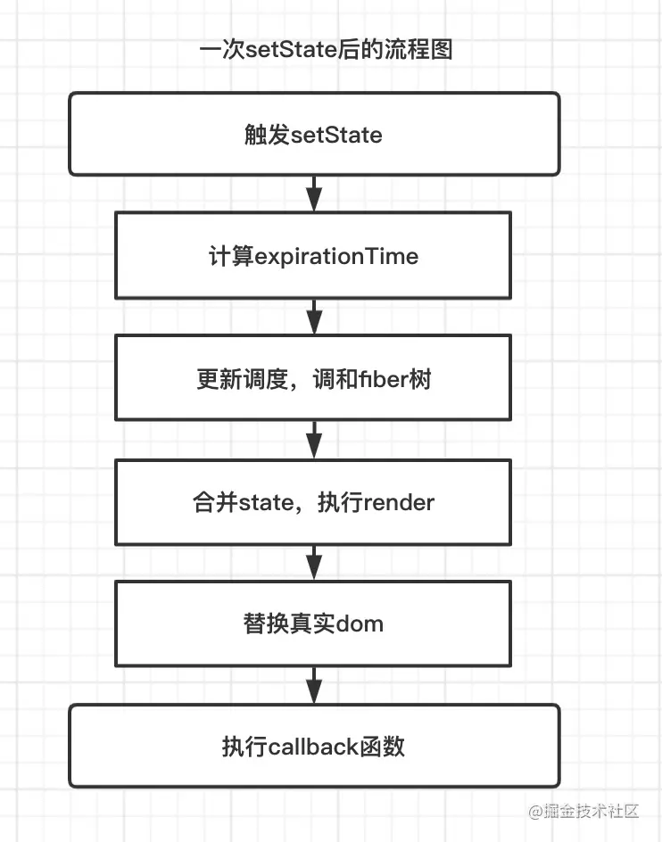
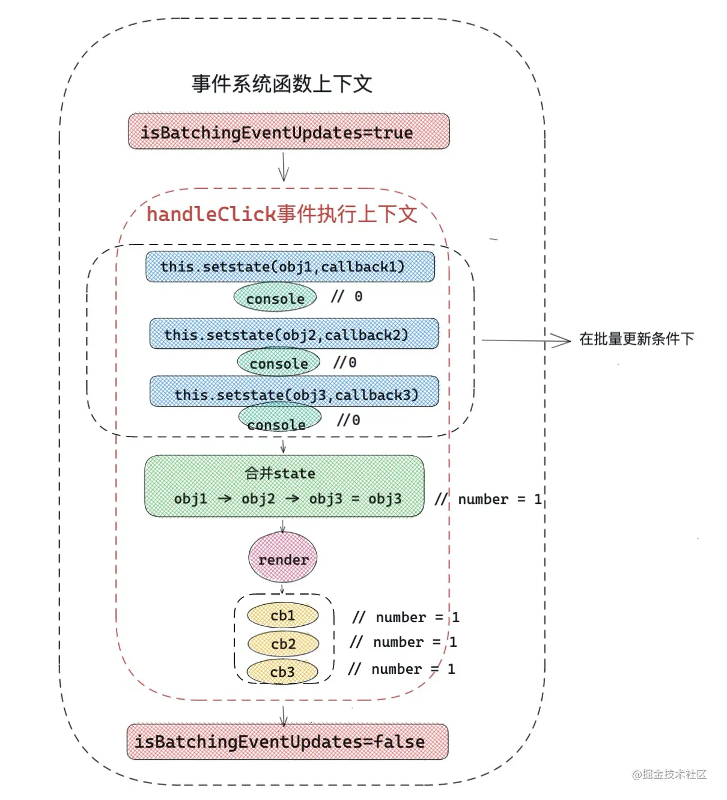
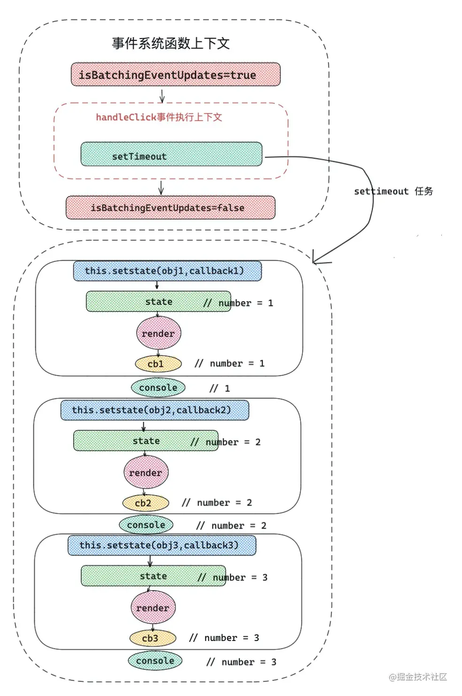

# 玄学state

## 一、前言
### 老生常谈，state到底是同步还是异步？

如果对React底层有一定了解，回答出batchUpdate批量更新概念，以及批量更新被打破的条件。

这在18之后会被打破，为什么这么说呢？

React是有多种模式，基本上平时用的`legacy`模式下的React，除了`legacy`模式，还有`blocking`模式
和`concurrent`模式，blocking可以视为concurrent的优雅降级版本和过度版本，React最终目的，不久的
未来将以concurrent模式作为默认版本，这个模式下会开启一些新功能。

- legacy 模式 `ReactDom.render(<App />, rootNode)` 
这是当前 React app 使用的方式。当前没有计划删除本模式，但是这个模式可能不支持这些新功能。

- blocking 模式： ReactDOM.createBlockingRoot(rootNode).render(<App />)。
目前正在实验中。作为迁移到 concurrent 模式的第一个步骤。
- concurrent 模式： ReactDOM.createRoot(rootNode).render(<App />)。

目前在实验中，未来稳定之后，打算作为 React 的默认开发模式。这个模式开启了所有的新功能。

### [特性对比](https://zh-hans.reactjs.org/docs/concurrent-mode-adoption.html#feature-comparison)

## 类组件state

流程图
;

;

;

```jsx
import ReactDOM from 'react-dom'
const { unstable_batchedUpdates } = ReactDOM;
export default class index extends React.Component{
    state = { number:0 }
    handerClick=()=>{
        setTimeout(()=>{
            unstable_batchedUpdates(()=>{
              this.setState({ number:this.state.number + 1 })
              console.log(this.state.number)
              this.setState({ number:this.state.number + 1})
              console.log(this.state.number)
              this.setState({ number:this.state.number + 1 })
              console.log(this.state.number) 
            })
        })
        this.setState({ number: 2  })
        ReactDOM.flushSync(()=>{
            this.setState({ number: 3  })
        })
        this.setState({ number: 4  })
    }
    render(){
        return <div>
            { this.state.number }
            <button onClick={ this.handleClick }  >number++</button>
        </div>
    }
} 
```
## 函数组件中的state

函数组件更新就是函数的执行，在函数一次执行过程中，函数内部所有变量重新声明，
所以改变的 state ，只有在下一次函数组件执行时才会被更新。
::: tips useState注意事项
::: 


### 类组件中的 setState 和函数组件中的 useState 有什么异同？
**相同点：**
- 首先从原理角度出发，setState和 useState 更新视图，
底层都调用了 scheduleUpdateOnFiber 方法，而且事件驱动情况下都有批量更新规则。

**不同点：**
- 在不是 pureComponent 组件模式下， setState 不会浅比较两次 state 的值，只要调用 setState，
在没有其他优化手段的前提下，就会执行更新
。但是 useState 中的 dispatchAction 会默认比较两次 state 是否相同，然后决定是否更新组件。
- setState 有专门监听 state 变化的回调函数 callback，可以获取最新state；
但是在函数组件中，只能通过 useEffect 来执行 state 变化引起的副作用。
- setState 在底层处理逻辑上主要是和老 state 进行合并处理，而 useState 更倾向于重新赋值。
