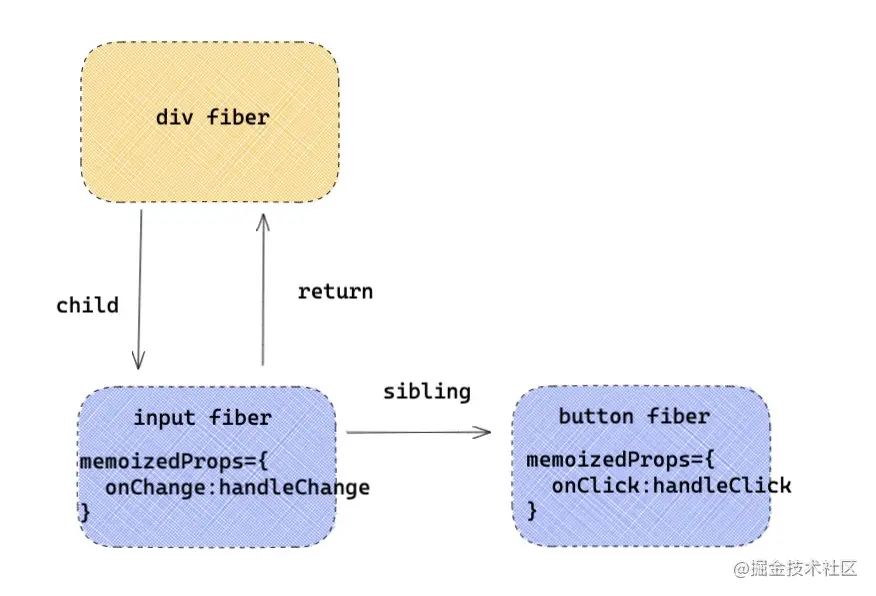
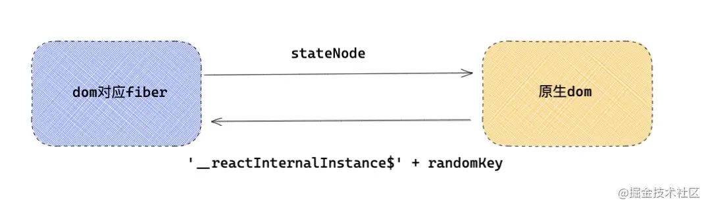
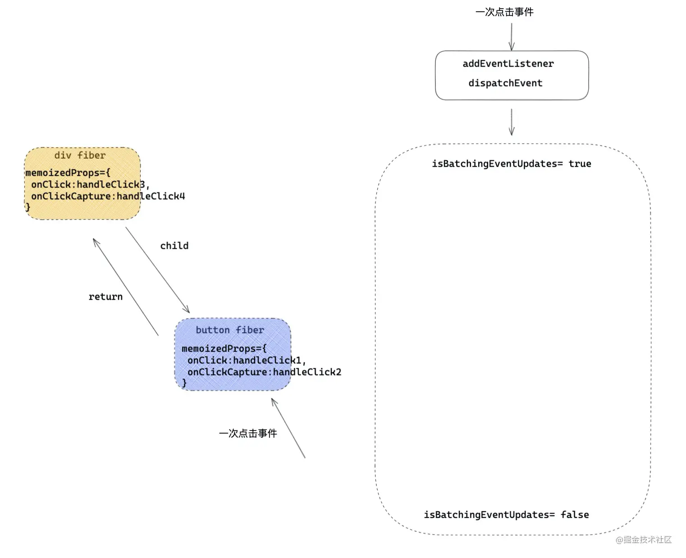
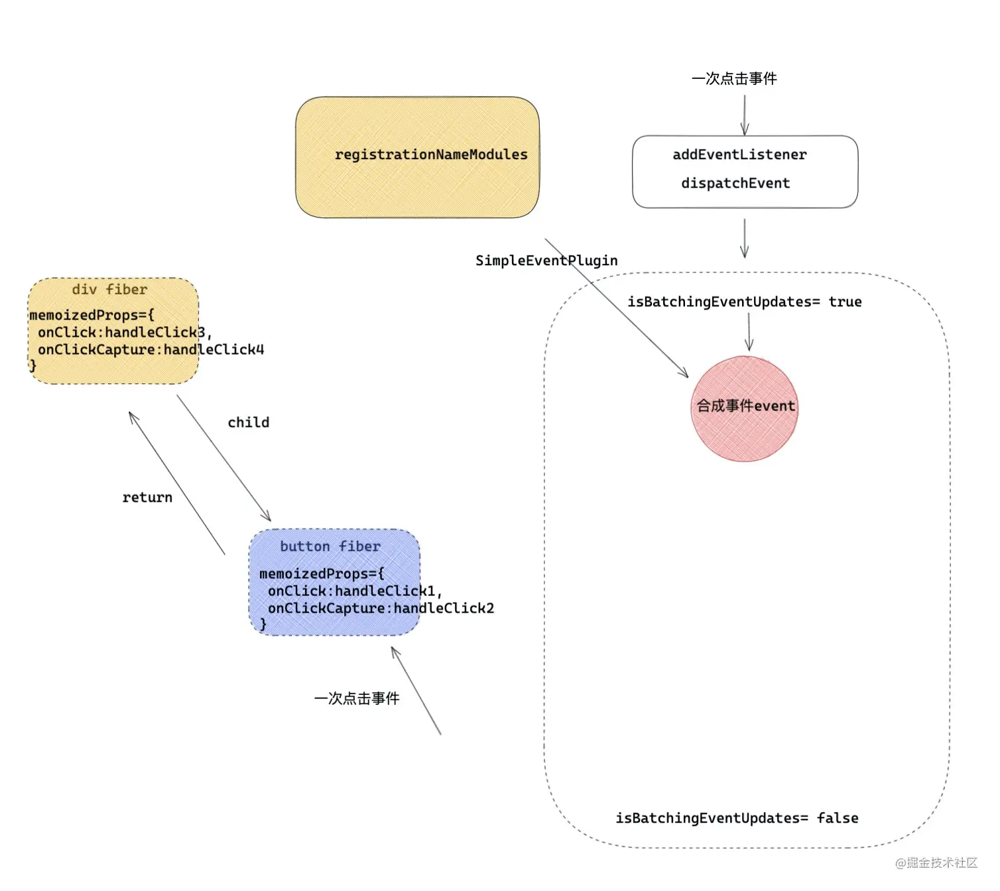
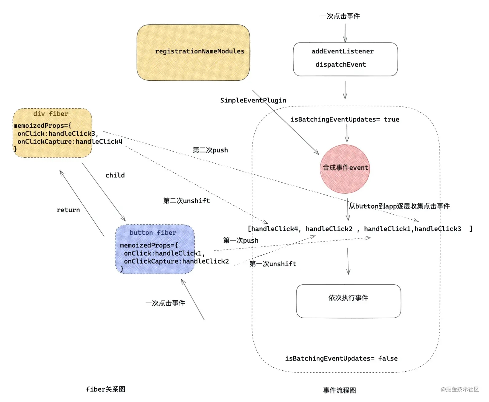

# 事件原理

## 一、前言
### 首先
在React应用中，我们所看到的React事件都是"假的"。假在哪里？

- 给元素绑定的事件，不是真正的事件处理函数。
- 在冒泡/捕获阶段绑定的事件，也不是在冒泡/捕获阶段执行的。
- 甚至在事件处理函数中拿到的事件源e，也不是真正的事件源e。

### 疑问
- React 为什么有自己的事件系统？ 
- 什么是事件合成 ？ 
- 如何实现的批量更新？
- 事件系统如何模拟冒泡和捕获阶段？
- 如何通过 dom 元素找到与之匹配的fiber？
- 为什么不能用 return false 来阻止事件的默认行为？
- 事件是绑定在真实的dom上吗？如何不是绑定在哪里？
- V17 对事件系统有哪些改变？

由于不是绑定在真实的DOM上，所以React需要模拟一套事件流：事件捕获 -> 事件源 -> 事件冒泡, 也包括重写
一下事件源对象event。


## 二、独特的事件处理
### 2.1冒泡阶段和捕获阶段
- 冒泡阶段：开发者正常给React绑定的事件加上onClick，onChange。默认会在模拟冒泡阶段执行。
- 捕获阶段：如果想要在捕获阶段执行可以将事件后面加上Capture后缀，比如onClickCapture，onChangeCapture

### 2.2阻止冒泡
React阻止冒泡和原生事件中的写法差不多，e.stopPropagation()；但底层原理不同。

### 2.3阻止默认行为
- 原生事件：e.preventDefault()和return false可以用来阻止事件默认行为。
- React事件: e.preventDefault()阻止事件默认行为，这个方法并非是原生事件的preventDefault,
由于React的事件源e也是独立组建的，所以需要显示调用preventDefault来告诉react来阻止默认行为，所以
return false在react应用中完全失去来作用。

## 三、事件合成

React事件系统可分为三个部分：
- 第一部分是在事件合成系统，初始化会注册不同的事件插件。
- 第二部分是在第一次渲染过程中，对事件标签中事件的收集，想container注册事件。
- 第三个部分就是一次用户交互，事件触发，到事件执行的一系列过程。

### 3.1事件合成概念

- React的事件不是绑定在元素上，而是统一绑定在顶部容器上，在V17之前是绑定在document上的，在
V17改变成了app容器。这样更利于一个html下存在多个应用（微前端）。
- 绑定事件并不是一次性绑定所有事件，比如发现了onClick事件，就回绑定click事件，比如发现了onChange事件，
会绑定[blur, change, focus, keydown, keyup]多个事件。
- React事件合成的概念：React应用中，元素绑定的事件并不是原生事件，而是React合成的事件，比如onClick是由
click合成，onChange是由blur，change，focus等多个事件合成。

### 3.2 事件插件机制
React有一种事件插件机制，比如onClick和onChange，会有不同的事件插件SimpleEventPlugin，
ChangeEventPlugin处理。

registration： 登记，注册
#### 第一个registrationNameModules：
```js
simple: '简单的'
capture: '捕获'
const registrationNameModules = {
  onBlur: SimpleEventPlugin,
  onClick: SimpleEventPlugin,
  onClickCapture: SimpleEventPlugin,
  onChange: ChangeEventPlugin,
  onChangeCapture: ChangeEventPlugin,
  onMouseEnter: EnterEventPlugin,
  onMouseLeave: EnterEventPlugin
}
```
registrationNameModules记录了React事件和与之对应的处理插件的映射。

::: tip 为什么要用不同的事件插件来处理不同的React事件
答：首先对于不用的事件，有不同的处理逻辑；对应的事件源对象也有所不同，React的事件和事件源是自己合成的，
所以对于不同事件需要不同的事件插件处理。
:::

#### 第二个registrationNameDependencies
```js
{
  onBlur: ['blur'],
  onClick: ['click'],
  onClickCapture: ['click'],
  onChange: ['blur', 'change', 'click', 'focus', 'input', 'keydown', 'keyup', 'selectionchange'],
  onMouseEnter: ['mouseout', 'mouseover'],
  onMouseLeave: ['mouseout', 'mouseover'],
  ...
}
```
这个对象保存了React事件和原生事件对应关系，这就解释了为什么上述只写了一个onChange，会有很多的原生
事件绑定在document上。在事件绑定阶段，如果发现有React事件，比如onChange，就会找到对应的原生事件数组，逐一绑定。

## 四、事件绑定
所谓事件绑定，就是在React处理props时候，如果遇到事件比如onClick，就会通过addEventListener注册原生事件，
例如onClick最后去了哪里？

最后去了fiber下memoizedProps属性上，如上结构会变成这样。
;

## 五、事件触发
一次点击事件
```jsx harmony
export default function Index(){
    const handleClick1 = () => console.log(1)
    const handleClick2 = () => console.log(2)
    const handleClick3 = () => console.log(3)
    const handleClick4 = () => console.log(4)
    return <div onClick={ handleClick3 }  onClickCapture={ handleClick4 }  >
        <button onClick={ handleClick1 }  onClickCapture={ handleClick2 }  >点击</button>
    </div>
}
```
### 5.1 批量更新
;
;
### 5.2 合成事件源

### 5.3 形成事件执行队列
;
### 5.4 react如何模拟阻止事件冒泡
::: tips legacy-events/EventBatching.js
```js
function runEventsInBatch(){
    const dispatchListeners = event._dispatchListeners;
    if (Array.isArray(dispatchListeners)) {
    for (let i = 0; i < dispatchListeners.length; i++) {
      if (event.isPropagationStopped()) { /* 判断是否已经阻止事件冒泡 */
        break;
      }    
      dispatchListeners[i](event) /* 执行真正的处理函数 及handleClick1... */
    }
  }
}
```
:::
## 六、总结

- React为什么有自己的事件系统？

答：因为对于不同的浏览器，对事件存在不同的兼容性，React想实现一个兼容全浏览器的框架，为了实现这个目标，
就需要创建一个兼容全浏览器的事件系统，以此抹平不同浏览器的差异。

- V17对事件系统有哪些改变？
- 事件是绑定在真实的dom上嘛？如果不是绑定在哪里？

答：**V17之前React事件都绑定在document上，V17之后React把事件绑定在应用对应的容器container上**，
将事件绑定在同一容器统一管理，防止很多事件直接绑定在原生的DOM元素上。造成一些不可控的情况。

- 什么是事件合成
答：在React应用中，元素的绑定并不是原生事件，而是React合成的事件，比如onClick是由click合成，
onChange是有blur，change，focus等多个事件合成。比如原生的checkbox、select没有onChange事件


1. 什么是事件合成。
2. 如何模拟事件捕获和事件冒泡阶段。
3. 如何处理事件源对象。
4. 一次点击到事件执行都发生了什么。
